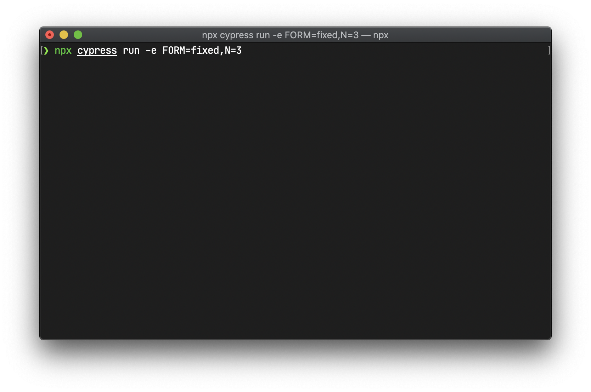

# Google Forms Automation

A generic script that fills out Google Forms automatically.

### Author

[Héctor Reyes](https://github.com/hreyesm)

## Demo


## Contents

- [Google Forms Automation](#google-forms-automation)
    - [Author](#author)
  - [Demo](#demo)
  - [Contents](#contents)
  - [Overview](#overview)
    - [Features](#features)
  - [Installation](#installation)
    - [Requirements](#requirements)
  - [Usage](#usage)
    - [JSON File Location](#json-file-location)
    - [JSON File Format](#json-file-format)
      - [URL](#url)
      - [Questions](#questions)
    - [Graphical View](#graphical-view)
    - [Command Line View](#command-line-view)
  - [License](#license)

## Overview

JavaScript / Cypress script that fills out Google Forms automatically.

### Features

- Graphical and command line view modes.
- Forms are filled out the desired number of times from a JSON file preloaded with data.
- Support for multi-section forms with the following [question types](#questions) (dropdown is not supported):
  - Short answer
  - Paragraph
  - Multiple choice
  - Checkboxes
  - Linear scale
  - Multiple choice grid
  - Checkbox grid
  - Date
  - Time

## Installation

### Requirements

- [Node.js](https://nodejs.org/en/) (10 or above)

Install from this repository:

```
git clone https://github.com/hreyesm/google-forms-automation
```

After cloning the repository and moving to the root directory, enter the command `npm install` to install devDependencies, including [Cypress](https://www.cypress.io/).

## Usage

### JSON File Location

JSON files corresponding to the forms to be filled out will only be processed if they are inside the [forms](./cypress/fixtures) subdirectory, as in the directory tree below; otherwise the script will not recognize them.

```
📦 google-forms-automation
┣ 📂 cypress
┃ ┣ 📂 fixtures
┃ ┃ ┣ 📂 forms
┃ ┃ ┃ ┗ 📜 example.json
```

### JSON File Format

The general structure of a JSON file supported by the script looks like the following:

```json
{
  "url": "Form URL",
  "questions": [...]
}
```

For a JSON file to work properly, it must be formatted according to the following guidelines.

#### URL

Due to how Cypress redirects to web pages, the URL to be included in the JSON file should not be abbreviated. A valid URL would be https://docs.google.com/forms/d/e/1FAIpQLSfZOj6_2ryFbvfrzTyCUT6prKCP7blBJpq9SIJnwPFl4X9hRQ/viewform?usp=sf_link, while an invalid one would be https://forms.gle/2vXJ9zTJdR664c9TA. Feel free to use the first one to test the script yourself.

#### Questions

The format of the questions to be included in the file will vary according to the nature of their respective answers.

- **Short Answer**

  ```json
  {
    "title": "Question title",
    "answer": {
      "type": "shortAnswer",
      "value": "Value to fill"
    }
  }
  ```

- **Paragraph**

  ```json
  {
    "title": "Question title",
    "answer": {
      "type": "paragraph",
      "value": "Value to fill"
    }
  }
  ```

- **Multiple Choice**

  ```json
  {
    "title": "Question title",
    "answer": {
      "type": "multipleChoice",
      "choice": "Option to select"
    }
  }
  ```

- **Checkboxes**

  ```json
  {
    "title": "Question title",
    "answer": {
      "type": "checkboxes",
      "choices": ["Option to select", ..., "Option to select"]
    }
  }
  ```

- **Linear Scale**

  ```json
  {
    "title": "Question title",
    "answer": {
      "type": "linearScale",
      "choice": "Option to select"
    }
  }
  ```

- **Multiple Choice Grid**

  ```json
  {
    "title": "Question title",
    "answer": {
      "type": "multipleChoiceGrid",
      "choices": [
        {
          "row": "Row title",
          "column": "Option to select"
        },
        ...,
        {
          "row": "Row title",
          "column": "Option to select"
        }
      ]
    }
  }
  ```

- **Checkbox Grid**

  ```json
  {
    "title": "Question title",
    "answer": {
      "type": "checkboxGrid",
      "choices": [
        {
          "row": "Row title",
          "columns": ["Option to select", ..., "Option to select"]
        },
        ...,
        {
          "row": "Row title",
          "columns": ["Option to select", ..., "Option to select"]
        }
      ]
    }
  }
  ```

- **Date**

  ```json
  {
    "title": "Question title",
    "answer": {
      "type": "date",
      "value": "YYYY-MM-DD"
    }
  }
  ```

- **Time**

  ```json
  {
    "title": "Question title",
    "answer": {
      "type": "time",
      "value": "HH:MM"
    }
  }
  ```

The [example.json](./cypress/fixtures/example.json) file included in this repository should give you a good idea on how to structure the form data.

### Graphical View

From the root directory, enter the following command to open the graphical Cypress Test Runner:

```
npx cypress open -e form=<Name of JSON file with form data>,n=<# of iterations>
```

For example, if we wanted the script to fill out the form specified in the [example.json](./cypress/fixtures/example.json) file a total of three times, we would enter the command as follows:


If successful, the command should open a window similar to this:


After that, click on the **google-forms-automation.spec.js** file shown. A Chrome window like the one below should appear:


The script should start running shortly after.

### Command Line View

From the root directory, enter the following command to run the command-line Cypress Test Runner:

```
npx cypress run -e form=<Name of JSON file with form data>,n=<# of iterations>
```

For example, if we wanted the script to fill out the form specified in the [example.json](./cypress/fixtures/example.json) file a total of three times, we would enter the command as follows:


The script should start running shortly after. If successful, the terminal should display the following information:


## License

The code of this repository was implemented by [Héctor Reyes](https://github.com/hreyesm). Released under the [MIT license](./LICENSE).
